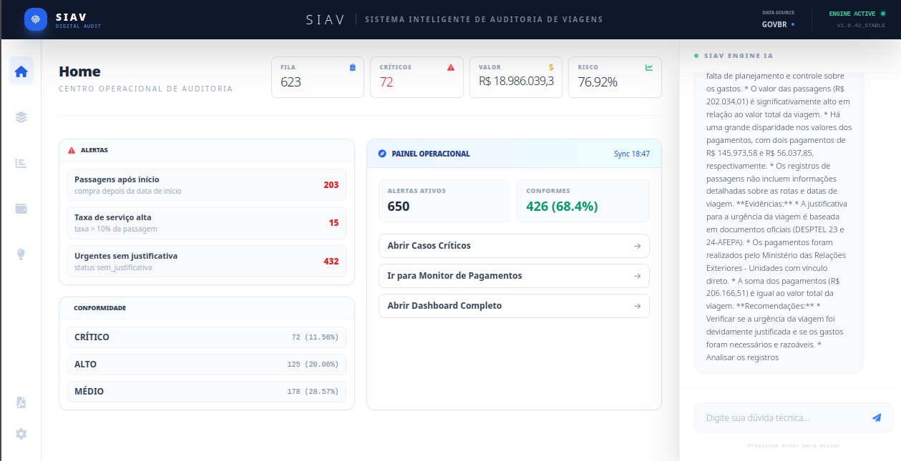
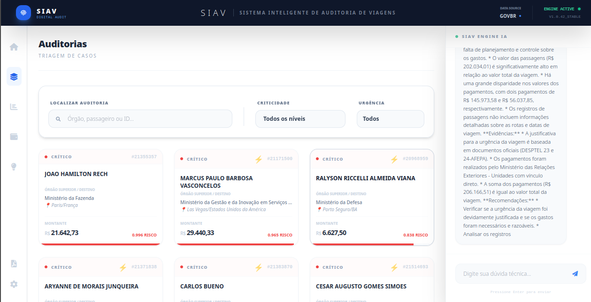
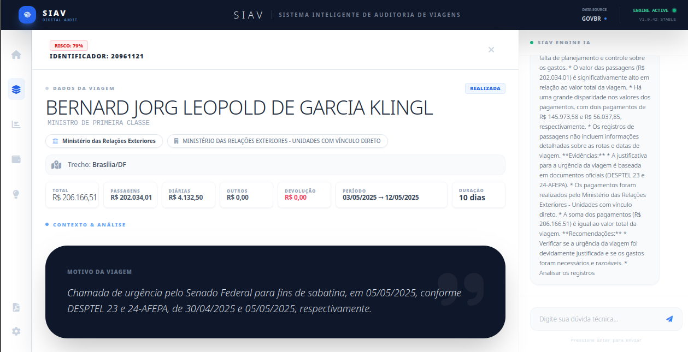
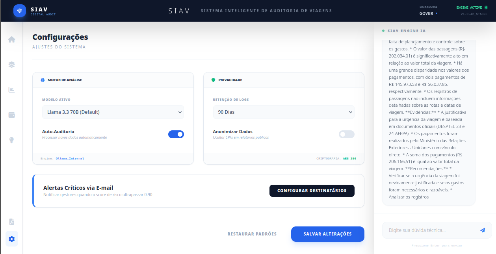

🔎 SIAV - Auditoria Inteligente de Gastos Públicos

    Sistema de auditoria automatizada focado em transparência pública, utilizando arquitetura RAG (Retrieval-Augmented Generation) e LLMs para detecção de anomalias em bases de dados governamentais (2011-2025).

O SIAV é o front-end inteligente de um ecossistema de dados projetado para auditar mais de 12GB de registros de viagens e diárias do Governo Federal. Ele não apenas exibe dados, mas "compreende" o contexto das justificativas através de Inteligência Artificial.
🏗️ Arquitetura do Projeto

O sistema foi desenhado sob os princípios de Clean Architecture e Domain-Driven Design (DDD), garantindo desacoplamento total entre a lógica de auditoria e os provedores de infraestrutura.

    app/domain: O núcleo (Core). Contém entidades e contratos de interface, totalmente independente de tecnologias externas.

    app/services: Camada de orquestração (Use Cases). Onde residem os fluxos de auditoria, conformidade e análise de risco.

    app/infrastructure: Implementações técnicas. Gerenciamento de conexões resilientes (SSL Retries), integração com Groq API, geração de Embeddings e busca vetorial em PostgreSQL/pgvector.

    app/schemas: Contratos de dados via Pydantic, garantindo integridade e validação rigorosa nas trocas entre API e Frontend.

    app/routers: Interface de exposição (FastAPI) seguindo padrões RESTful.

    static: Frontend reativo em Vanilla JS com arquitetura de Controllers e Store customizada para gerenciamento de estado sem dependências pesadas.

🛠️ Stack Tecnológica

    Runtime: Python 3.12+ (Otimizado para alto desempenho).

    API Framework: FastAPI com Servidor ASGI Uvicorn.

    AI Engine: Groq Cloud (Llama 3 / Mixtral) para inferência de baixa latência.

    Vector Search: pgvector para busca semântica de justificativas.

    Data Processing: Polars (High-performance DataFrame library) para manipulação de dados com baixo footprint de memória.

    Frontend: JavaScript moderno (ES6+) com foco em performance e interatividade.

    Data Source: Integração com Azure Data Lake (Arquivos Parquet) para análise histórica.

🚀 Como Executar
Pré-requisitos

    Python 3.12 ou superior.

    Chave de API da Groq e Hugging Face configuradas no .env.

    Acesso ao banco de dados PostgreSQL com extensão vector habilitada.

Instalação e Setup

    Clone o repositório:
    Bash

    git clone https://github.com/rogeriosprf/GOVBR-Auditoria-App.git
    cd GOVBR-Auditoria-App

    Configure o ambiente:
    Crie um arquivo .env baseado no .env.example e preencha suas credenciais.

    Instale as dependências:
    Bash

    pip install -r requirements.txt

    Inicie o servidor:
    Bash

    python main.py

    Acesse: http://localhost:8000

📈 Diferenciais Técnicos

    Arquitetura RAG (Retrieval-Augmented Generation): Diferente de chatbots comuns, o SIAV consulta fatos reais e vetores de conformidade no banco de dados antes de gerar análises, eliminando alucinações da IA.

    Eficiência de Recursos: Projetado para rodar em hardware com recursos limitados (como instâncias cloud free-tier ou hardware legado), utilizando processamento vetorizado e streams de dados.

    Resiliência de Dados: Implementação de Exponential Backoff e SSL Retry para garantir estabilidade em conexões com bancos de dados remotos e APIs externas.

    Modularidade Total: Graças à Inversão de Dependência, é possível trocar o modelo de LLM ou o motor de busca vetorial alterando apenas a camada de infraestrutura.

🔗 Ecossistema de Auditoria

Este repositório é a interface de usuário de um pipeline maior de engenharia de dados:

    Pipeline de Dados: Ingestão de 12GB de dados brutos e limpeza.

    Audit-BI: Modelagem de cubos analíticos e métricas de risco.

Desenvolvido por Rogério Oliveira Engenheiro de Dados & Desenvolvedor Fullstack com foco em soluções de alta performance.

## 🖼️ Interface do Sistema

Abaixo, algumas capturas de tela do sistema em operação, demonstrando a interface reativa e os módulos de análise.

  
  

  
  

> **Nota:** As capturas acima mostram o fluxo desde o monitoramento de alto nível (KPIs) até a investigação profunda via RAG (Retrieval-Augmented Generation) com suporte de IA.